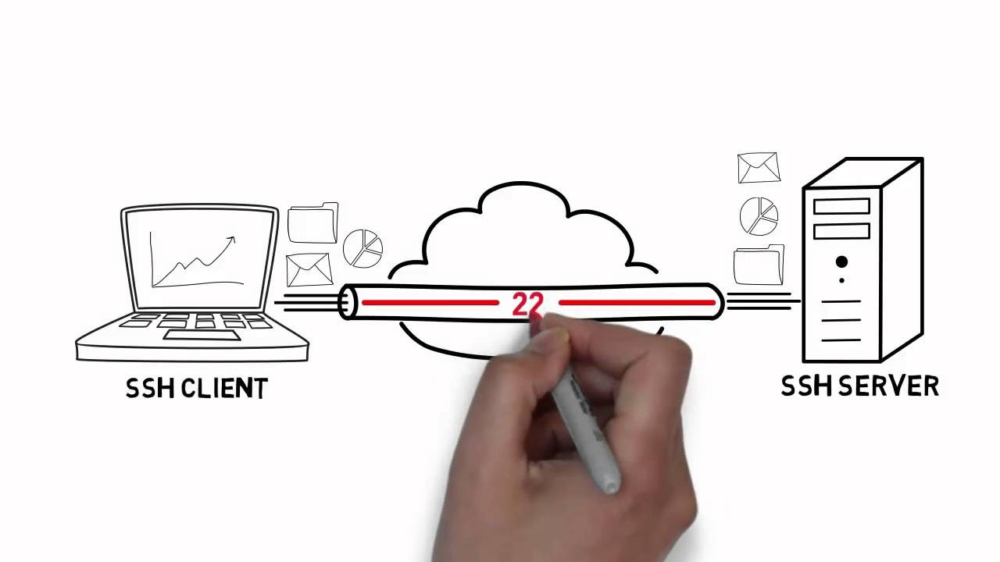

# OpenSSH và những điều bạn cần biết

## Mở đầu

**OpenSSH** là một chương trình mã nguồn mở giúp người dùng có thể quản lý linux server ở mọi lúc mọi nơi dựa trên giao thức SSH (Secure Shell protocol). Từ phòng làm việc, đến phòng ngủ, quán cà phê. Ở bài viết này, mình xin giới thiệu đến các bạn những tiện ích cơ bản của OpenSSH.

## OpenSSH là gì?

- **OpenSHH** là một chương trình quản lý kết nối, nó giúp bạn có thể kết nối đến và điều khiển một máy tính khác.
- Được phát triển bởi _OpenBSD_, nhưng **OpenSSH** lại được cài đặt sẵn trong hầu hết các distro của linux khiến nhiều người lầm tưởng rằng **OpenSSH** là của Linux phát triển.
- Nó gần như được xem là một chuẩn cho kết nói máy tính từ xa (remote access) trong cộng đồng sử dụng Linux.
- _OpenSSH_ được xem là một bộ tiện ích mà trong đó các thành phần server và client là quan trọng nhất.

## Tại sao sử dụng OpenSSH?

Giả sử bạn đang ở nhà mình. Buổi tối, bạn chợt nhận ra là mình đã quên reset server trên công ty. Lúc đó, thay vì bạn phải lấy xe chạy từ nhà lên công để reset, bạn có thể đơn giản hơn là sử dụng OpenSSH để truy cập vào server của công ty từ xa và reboot server.

## Kết nói với Server

Ở phần này, mình sẽ hướng dẫn cách kết nối với remote server sử dụng OpenSSH
